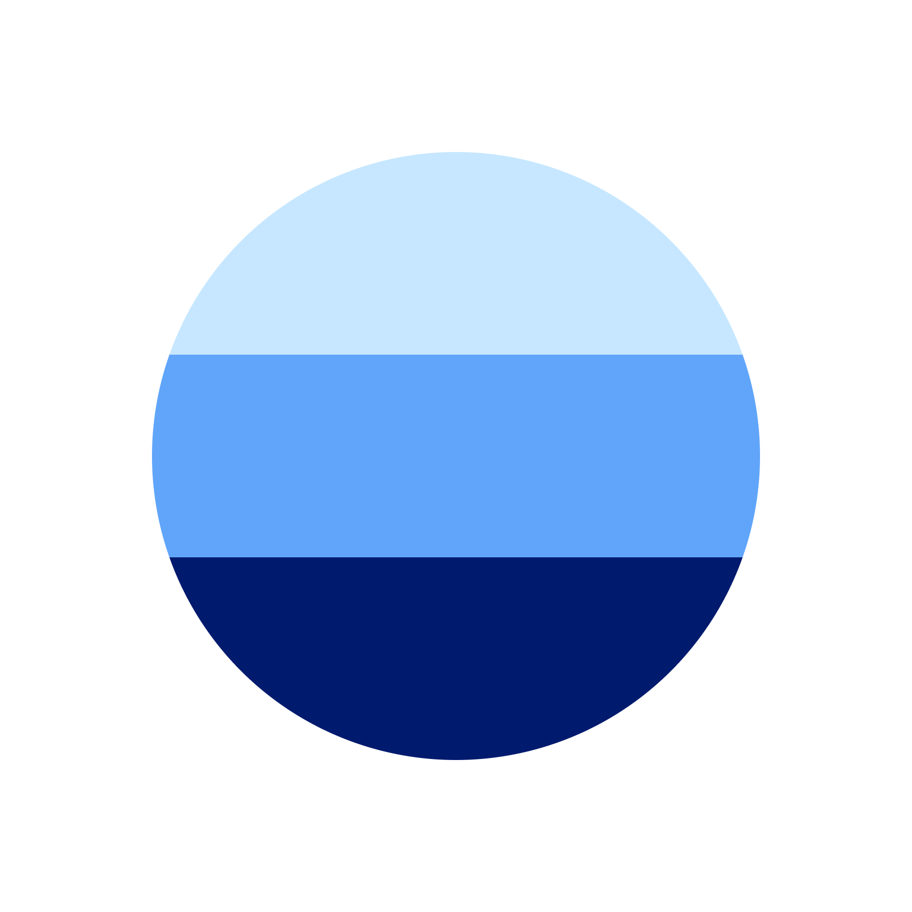

<div align="center">



<h1 align="center">
    OrthoQA-1k: A Larger Structured Synthetic Dataset of Orthopedic Surgery Q&A
</h1>

<h3 align="center">
    An academic resource for advancing research in orthopedic surgery question answering and medical NLP.
</h3>

[](https://opensource.org/licenses/Apache-2.0)

[](https://doi.org/)
[]()


</div>

- **Version:** 1.0  
- **Published:** 2025-06-16  
- **License:** Apache License 2.0
- **DOI:** [here]()
- **Hugging Face link** [here]()
- **Zenodo link** [here]()
- **Github link** [here]()

## Description
Ortho-1K is a synthetic, structured Q&A dataset generated
using a templated prompt framework over GPT-3.5-turbo, designed 
to support medical NLP research in orthopedic surgery. 
All content is fully synthetic and free of PHI. 
This dataset enables rapid finetuning and benchmarking of 
domain-specific language models for clinical decision support, 
patient education, and surgical consultation use cases.


## Contributing
Contributions are welcome! Feel free to:
- Report issues.
- Create pull requests.

## Citation
```bibtex
@dataset{ridwan2025orthoqa1kalargerstructuredsyntheticdatasetoforthopedicsurgeryq&adata,
  author = {Ridwan, A, Hossain, R},
  title  = {OrthoQA-1k: A Larger Structured Synthetic Dataset of Orthopedic Surgery Q&A},
  year   = {2025},
  url    = {},
  doi    = {},
  note   = {Version 1.0, Stratum Research}
}
```


## Contact
If you have any questions, please contact the maintainer at abdullah.ridwan@stratumresearch.org.

Contact Stratum Research at contact@stratumresearch.com
